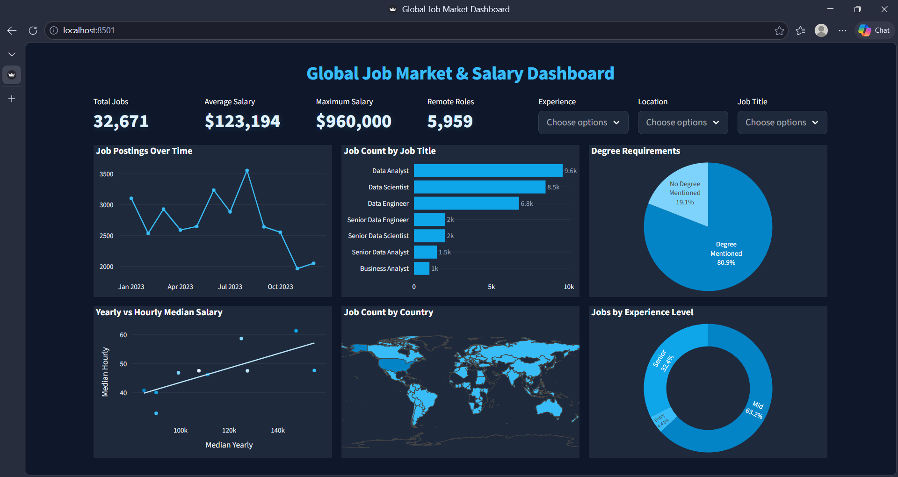

# 📊 Global Job Market & Salary Dashboard

> An interactive analytics dashboard built with **Streamlit** and **Plotly** — exploring global data job postings, salary trends, experience levels, and hiring patterns across **111 countries** and **10 job categories** throughout **2023**.

🔗 **Live Demo:** [global-job-dashboard.streamlit.app](https://global-job-dashboard.streamlit.app/)



---

## 🖥️ Dashboard Overview

The dashboard is themed in a **deep navy blue** (`#0f172a`) with **sky blue** (`#38bdf8`) accents — providing a clean, modern analytics aesthetic. It presents 6 interactive Plotly charts alongside 4 live KPI cards, all updating instantly as filters are applied.

### 📌 KPI Cards (Top Row)

| Metric | Description |
|---|---|
| 🔢 Total Jobs | Count of job postings matching current filters |
| 💰 Average Salary | Mean annual salary across filtered postings |
| 🏆 Maximum Salary | Highest annual salary in filtered data |
| 🏠 Remote Roles | Number of work-from-home positions |

---

## 📊 Charts & Visualisations

### 📈 Job Postings Over Time *(Line Chart)*
Monthly job posting volume across 2023, showing hiring trends and seasonal patterns. Each data point is marked and hoverable.

### 📊 Job Count by Job Title *(Horizontal Bar Chart)*
Top 7 most in-demand job roles ranked by posting count, with formatted count labels displayed outside each bar.

### 🎓 Degree Requirements *(Pie Chart)*
Split between roles that mention degree requirements versus those that don't — useful for understanding entry barriers across the job market.

### 💵 Yearly vs Hourly Median Salary *(Scatter Plot with OLS Trendline)*
Each bubble represents a job category plotted by its median annual salary (X-axis) vs median hourly salary (Y-axis). An OLS regression trendline shows the overall relationship. Powered by `statsmodels`.

### 🌍 Job Count by Country *(Choropleth Map)*
World map shaded by number of job postings per country, highlighting global hiring hotspots using a natural earth projection.

### 🎯 Jobs by Experience Level *(Donut Chart)*
Distribution of postings across three experience tiers — **Entry**, **Mid**, and **Senior** — derived automatically from job title keywords.

---

## 🎛️ Filters

Three multiselect filters control all 6 charts and all 4 KPIs simultaneously:

| Filter | Options |
|---|---|
| **Experience** | Entry / Mid / Senior |
| **Location** | 111 countries |
| **Job Title** | 10 role categories (Data Analyst, Data Scientist, Data Engineer, etc.) |

Leaving a filter empty shows all data. Filters combine with AND logic.

---

## 📱 Mobile Responsiveness

The dashboard uses **JavaScript-based mobile detection** (`window.innerWidth <= 768`) to inject `?mobile=1` as a query parameter. Python reads this via `st.query_params` and renders a completely different layout:

| Feature | Desktop | Mobile |
|---|---|---|
| Filters | 3 multiselects in a top-right row | 3 stacked full-width multiselects |
| KPI layout | 4 cards in a single row | 2×2 grid |
| Charts | 2 rows × 3 columns | 6 charts stacked vertically |
| Chart height | 260px | 220px |

---

## 🗂️ Project Structure

```
├── app.py                              # Main Streamlit application
├── data/
│   ├── data_jobs_salary_clean.xlsx     # Primary dataset (used by app)
│   ├── data_jobs_salary_all.xlsx       # Raw/unfiltered dataset
│   └── data_jobs_salary_featured.xlsx  # Dataset with pre-computed feature columns
├── images/
│   └── preview.png                     # Dashboard screenshot (used in README)
├── requirements.txt                    # Python dependencies
└── README.md
```

---

## 📋 Dataset

**File used:** `data/data_jobs_salary_clean.xlsx`

**Coverage:** 32,671 job postings · 111 countries · Jan–Dec 2023

| Column | Type | Description |
|---|---|---|
| `job_title_short` | str | Standardised role category (e.g. Data Analyst) |
| `job_title` | str | Full job title as posted |
| `job_location` | str | City/region of the role |
| `job_country` | str | Country of the role |
| `job_via` | str | Platform where the job was posted |
| `job_schedule_type` | str | Full-time, Part-time, etc. |
| `job_work_from_home` | bool | Whether the role is remote |
| `job_posted_date` | datetime | Date the job was posted |
| `job_no_degree_mention` | bool | True if no degree requirement is stated |
| `job_health_insurance` | bool | Whether health insurance is mentioned |
| `salary_rate` | str | Hourly or yearly salary rate type |
| `salary_year_avg` | int | Average annual salary ($15,000 – $960,000) |
| `salary_hour_avg` | float | Average hourly salary |
| `company_name` | str | Hiring company name |
| `job_skills` | str | Skills mentioned in the posting |

### Derived Columns (computed at load time)

| Column | Logic |
|---|---|
| `experience_category` | Parsed from `job_title` via regex: `senior/lead/director` → **Senior**, `junior/intern/entry` → **Entry**, otherwise → **Mid** |
| `salary_category` | Quantile-based: bottom 33% → **Low**, 33–67% → **Medium**, top 33% → **High** |
| `Posted_Month` | `job_posted_date` formatted as `YYYY-MM` for the line chart |

---

## 🚀 Running Locally

**1. Clone the repository**
```bash
git clone https://github.com/your-username/global-job-dashboard.git
cd global-job-dashboard
```

**2. Install dependencies**
```bash
pip install -r requirements.txt
```

**3. Place the dataset**

Make sure the data file is at:
```
data/data_jobs_salary_clean.xlsx
```

**4. Run the app**
```bash
streamlit run app.py
```

Open [http://localhost:8501](http://localhost:8501) in your browser.

---

## 📦 Requirements

```
streamlit
pandas
plotly
openpyxl
statsmodels
```

> `openpyxl` is required to read `.xlsx` files via `pd.read_excel()`.  
> `statsmodels` is required by Plotly's `trendline="ols"` in the scatter chart.

---

## 🧰 Tech Stack

| Tool | Purpose |
|---|---|
| [Streamlit](https://streamlit.io) | Web app framework |
| [Plotly Express](https://plotly.com/python/plotly-express/) | Line, bar, pie, scatter, choropleth charts |
| [Pandas](https://pandas.pydata.org) | Data loading, filtering, groupby aggregations |
| [openpyxl](https://openpyxl.readthedocs.io) | Excel file reading engine |
| [statsmodels](https://www.statsmodels.org) | OLS trendline in scatter plot |
| Custom CSS + JS | Dark navy theme, mobile detection, KPI card styling |

---

## ✨ Design Highlights

- **Deep navy theme** — `#0f172a` background with `#38bdf8` sky blue accents for a polished analytics feel
- **Smart experience classification** — regex-based keyword parser categorises any job title into Entry / Mid / Senior without needing a lookup table
- **Quantile-based salary buckets** — Low/Medium/High bands are computed dynamically from the actual data distribution, not hardcoded thresholds
- **JS mobile detection** — viewport width is checked client-side and passed as a URL query param; Python then branches into two completely separate layouts
- **`@st.cache_data`** — data is loaded and processed only once per session, keeping filters fast on every interaction
- **OLS trendline** — the scatter chart uses ordinary least squares regression to reveal the salary correlation across all job categories

---

## 📸 Preview


| Desktop | Mobile |
|---|---|
| 3×2 chart grid with KPI row | Stacked charts with 2×2 KPI grid |

---

## 🙌 Author

Built by **Nagenthiran** · [GitHub](https://github.com/nagenthiran10)

---

> ⭐ If you found this useful, consider starring the repository!